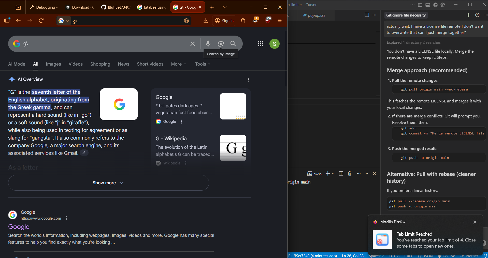
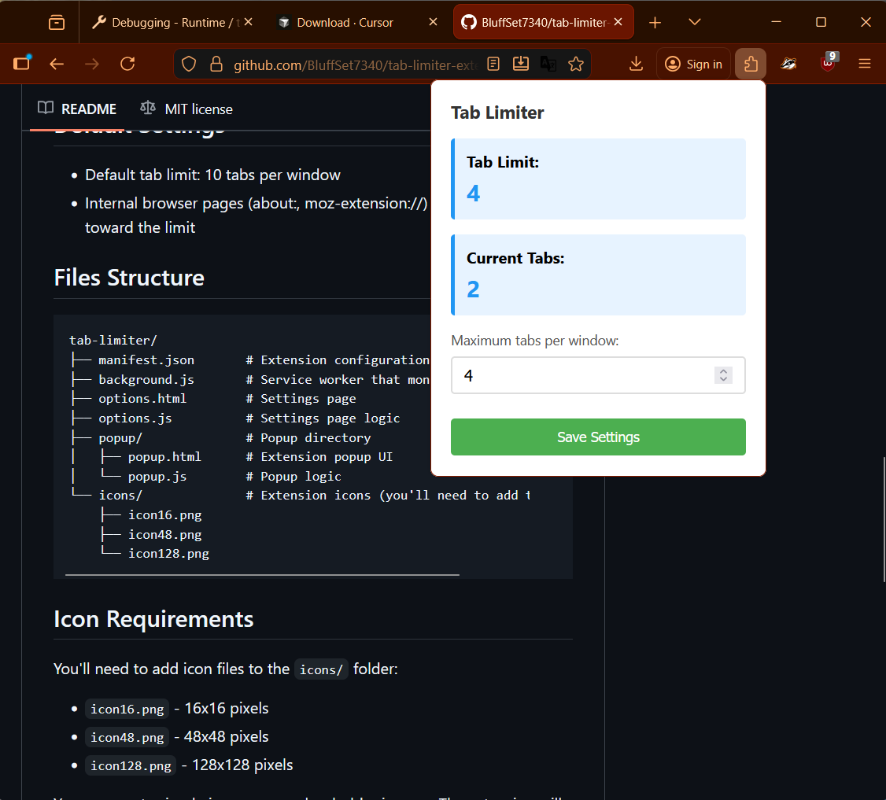

# Tab Limiter Extension (Firefox)

I created this extension using cursor and now trying to understand how it all works together to help in creating future extensions inshallah. 

A Firefox browser extension that limits the number of tabs you can open in any browser window. When you try to open more tabs than your set limit, the new tab will automatically close.

## Features

- Set a custom tab limit per window
- Automatically closes tabs that exceed the limit
- Shows notifications when the limit is reached
- Easy-to-use settings in popup
- Quick access popup to view current status via pin to toolbar

## Installation

### Firefox

1. Open Firefox and navigate to `about:debugging`
2. Click "This Firefox" in the sidebar
3. Click "Load Temporary Add-on"
4. Select the `manifest.json` file from this folder
5. The extension is now installed!

**Note:** For permanent installation, you'll need to package the extension and install it through Firefox Add-ons Manager or submit it to addons.mozilla.org.

## Usage

1. **Set your tab limit:**
   - Click the extension icon in your toolbar
   - Click "Open Settings" or right-click the icon and select "Options"
   - Enter your desired tab limit (1-100)
   - Click "Save Settings"

2. **Monitor your tabs:**
   - Click the extension icon to see your current tab count and limit
   - The extension will automatically close any new tabs that exceed your limit

## How It Works

- The extension monitors all tab creation events
- When a new tab is created, it counts the current tabs in that window
- If the count exceeds your limit, the new tab is immediately closed
- A notification will appear to inform you that the limit was reached

## Default Settings

- Default tab limit: 10 tabs per window
- Internal browser pages (about:, moz-extension://) are not counted toward the limit

## Icon Requirements

You'll need to add icon files to the `icons/` folder:
- `icon16.png` - 16x16 pixels
- `icon48.png` - 48x48 pixels  
- `icon128.png` - 128x128 pixels

You can create simple icons or use placeholder images. The extension will work without icons, but they improve the user experience.

## Permissions

- **tabs**: Required to monitor and manage tabs
- **storage**: Required to save your tab limit preference
- **notifications**: Used to notify you when the tab limit is reached

## Troubleshooting

- If tabs aren't being limited, make sure the extension is enabled
- Check that your tab limit is set correctly in the options page
- Refresh any open tabs after changing settings

## License

MIT License - feel free to modify and distribute!

## Demo 

-----

## Journal

Okay some issues with the tab limiter and its current tab count. Both are stuck on "loading" so will have to debug this 

I checked the console log and found that there is no ID for the extension, hence causing issues with permissions. I added the ID and now it seems to be working

okay so testing the code from cursor I realized that if you open the extension settings page to set the limit for number of tabs it works on the windows that it was originally openend in. However, if you take that tab into its own window and try the same test it doesn't work on the new window but works on the current window so gotta debug that son

I want to understand the intricacies of this extension that cursor created, so leaving comments and notes for my own future reference.

Stll writing comments and understanding how this all works. Alhamdulillah my understanding increases day by day

Right now trying to publish this extension to mozilla, made and account and trying to get my zipped package validated. Need to add the data collection property to my manifest.json file. I am not collecting data but you still have to add the property and specify none

realized that I am using manifest v2 but the extension works fine with it so I am sticking to it

also learnt that service_workers key and scripts key are the same thing - perform functions in the background the only difference is that the scripts key is used for firefox and the former is used for chrome, I'm making this extension for firefox so using scripts key. 

Also has to change the add-on id since it conflicted with already existing extensions so modified it to fix that validation error when submitting the extension

